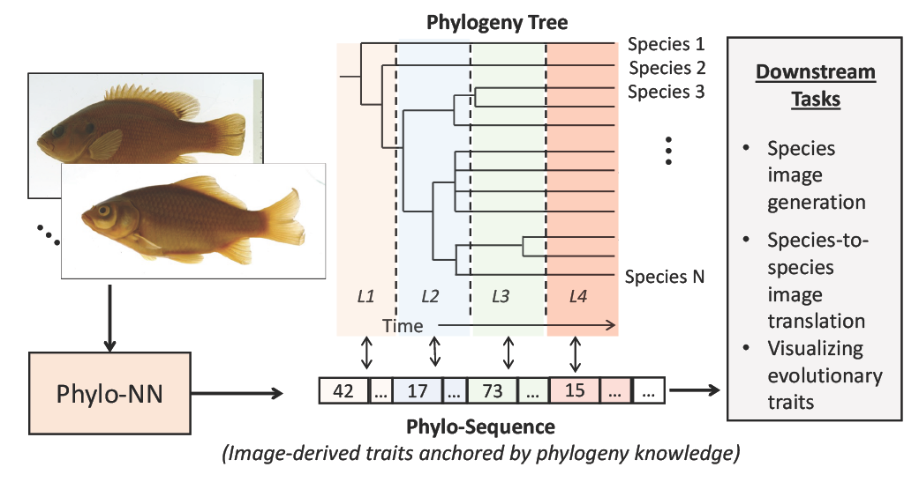

# Discovering Novel Biological Traits From Images Using Phylogeny-Guided Neural Networks
##### KDD'23 submission


**Abstract** One of the grand challenges in biology is to find features of organisms--or traits--that define groups of organisms, their genetic and developmental underpinnings, and their interactions with environmental selection pressures. Traits can be physiological, morphological, and/or behavioral (e.g., {beak color, stripe pattern, and fin curvature}) and are integrated products of genes and the environment. The analysis of traits is critical for predicting the effects of environmental change or genetic manipulation, and to understand the process of evolution. For example, discovering traits that are heritable across individuals, or across species on the tree of life (also referred to as the phylogeny), can identify features useful for individual recognition or species classification, respectively, and is a starting point for linking traits to underlying genetic factors. Traits with such genetic or phylogenetic signal, termed evolutionary traits, are of great interest to biologists, as the history of genetic ancestry captured by such traits can guide our understanding of how organisms vary and evolve. This understanding enables tasks such as estimating the morphological features of ancestors, how they have responded to environmental changes, or even predicting the potential future course of trait changes. However, the measurement of traits is not straightforward and often relies on subjective and labor-intensive human expertise and definitions. Hence, trait discovery}has remained a highly label-scarce problem, hindering rapid scientific advancement.

## Requirements
Use:
```
pip install -r requirements.txt
```

Make sure to use the following torch versions:

`pip install  torch==1.7.0+cu110 -f https://download.pytorch.org/whl/cu110/torch-1.7.0%2Bcu110-cp38-cp38-linux_x86_64.whl`

`pip install torchvision==0.8.1+cu110 -f https://download.pytorch.org/whl/cu110/torchvision-0.8.1%2Bcu110-cp38-cp38-linux_x86_64.whl`

## Dataset
In this work, we used a curated dataset of Teleost fish images from five ichthyological research collections that participated in  [the Great Lakes Invasives Network Project](https://greatlakesinvasives.org/portal/index.php) (GLIN). After obtaining the raw images from these collections, we handpicked a subset of about $11,000$ images and pre-processed them by resizing and appropriately padding each image to be of a $256\times256$ pixel resolution. Finally, we split the subset into a training set and a validation set of ratios $80\%$ and $20\%$, respectively. Our dataset includes images from 38 species of Teleost fishes with an average number of $200$ images per species.

These images can be found [here](https://drive.google.com/drive/folders/1gkau9TOP6hi76hY8FgP6VpII871SUHRD?usp=share_link).

## Overview of pretrained models
The pretrained model used in our experiments can be found [here](https://drive.google.com/drive/folders/1g-7LL6iPtqaUbQKAgxS8E8I5GvWW8gDZ?usp=share_link). 


## Training a model
In order to train one of our models, use the following command:
```
python main.py --prefix <prefix> --name <name> --postfix <postfix> --base <yaml file> -t True --gpus <comma-separated GPU indices>
```
* **prefix** : The path to where the model will be saved
* **name** : run name
* **postfix**: a postfix for the run's name
* **base**: the `yaml` config file.

The training script is similar and based on that provided by [taming-transformers](https://github.com/CompVis/taming-transformers)

Under `configs` directory, we have prepopulated some of the `yaml` files we have used in our own training.

## Generating images from a trained transformer.
Once a PhyloNN transformer model is trained, images can be generated using the following command:
```
python analysis/generate_with_transformer.py --config <path to analysis yaml file>
```
In the analysis `yaml` file:
* **ckpt_path** : The saved model
* **yaml_path** : The saved model's config
* **outputdatasetdir** : where the images are generated
* **save_individual_images**: whether to save individual images or just collate them in a grid
* **DEVICE**: GPU index to use
* **file_list_path**: path to training dataset
* **size**: image resolution


For vanilla VQGAN, use the same script that was provided by [taming-transformers](https://github.com/CompVis/taming-transformers)

```
python analysis/make_samples.py -r <path to ckpt file> -c <path to model's yaml file> --outdir <directory where to save the images> 
```
* **ckpt file** : The saved model


## Generating sequence histograms 

To generate the sequence histograms of a model's embeddign space, use
```
python analysis/code_histograms.py --config <path to analysis yaml file>
```
In the analysis `yaml` file:
* **unique_skipped_labels** : In the unseen species experiment, this lists the ids of the species that are unseen by the model during training
* **per_phylo_level** : whether to generate species level histograms only, or higher ancestral levels as well.
* **visualize_histograms**: whether to save the calculated histograms as images or just calculate them and save them as pkl files.

For this, and most other scripts, the analysis (e.g., images, JSON files, etc.) will be save under the same path as the model's directory.

## Calculating histogram JS-divergence matrices 
Use the following script:
```
python analysis/generate_histograms_matrix.py --config <path to analysis yaml file>
```


## Calculating aggregate JS-divergence between two species 
Use the following script:
```
python analysis/compare_histograms.py --config <path to analysis yaml file>
```
In the analysis `yaml` file:
* **species1** : The *name* of the first species
* **species2** : The *name* of the second species


## Calculating phylogenetic and morphological correlations with the embeddign space. 
Use the following script:
```
python analysis/get_correlation.py --config <path to analysis yaml file>
```
In the analysis `yaml` file:
* **path**: the path to finding the JS-divergence csv files generated by `analysis/generate_histograms_matrix.py`
* **file_name**: Where to output the JSON file containing the correlation value 
* **output_names**: 
* **arrays1** : The names of the JS-divergence csv files
* **arrays2** : Full path to the phylogenetic or morphological ground truth csv file.

**output_names**, **arrays1**, and **arrays2** should have the same number of entried.

We have provided all the necessary `yaml` files for reproducing the results in our paper.


## Specimen translation
To show intermediate steps along the translation between one specimen and another, use the following code:
```
python analysis/specimen_translation.py --config <path to analysis yaml file>
```
In the analysis `yaml` file:
* **ckpt_path** : The saved model
* **yaml_path** : The saved model's config
* **file_list_path** : The dataset from which the specimens' images come
* **image_index1** : index of the source specimen image within the dataset
* **image_index2** : index of the target specimen image within the dataset
* **count** : If translating a bunch of images simultaniously is desired, `count` can be set to determine the number of consequative images, starting from `image_index1` and `image_index2` that will be translated into each other.
* **show_only_key_imgs** Whether to show every since intermediate step or just the key steps.


## t-SNE plots
To the genrate t-SNE plots of a model's embedding, use:
```
python analysis/tsne.py --config <path to analysis yaml file>
```
In the analysis `yaml` file:
* **ckpt_path** : The saved model
* **yaml_path** : The saved model's config
* **file_prefix** : The prefix to generate t-SNE plot files.
* **phylogeny_path** : Path to the phylogeny in case you are interested in t-SNE plots color-coded based on ancestral levels. Otherwise, leave blank to get those plots for species levels.
* **level** : If `phylogeny_path` is provided, specify which ancestral level
* **phyloDistances_string** : If `phylogeny_path` is provided, specify the phylogenetic quantization distances for each level. defaults are included in the default files.
* **which_tsne_plots** : `standard` will color code the t-SNE plot based on the species or ancestral level of interest. `knn` will plot the same t-SNE plot but color-coded based on the phylo-distance error compared to a point's KNN-neighbors.


## Baselines

### Latent Space Factorization (LSF)
LSF is a method for disentangling latent space, described in the paper [Latent Space Factorisation and Manipulation via Matrix Subspace Projection](https://arxiv.org/abs/1907.12385)

### Image translation - LSF
```
python analysis/translateLSF.py --config <yaml file>
```
* **config**: the `yaml` config file.
Under `analysis/configs` directory, we have prepopulated the `yaml` files we have used in our own experiment for image translation under the name `translateLSF.yaml`.

### TSNE plots - LSF
Use the following script:
```
python analysis/tsneLSF.py --config <yaml file>
```

### Heatmap of cosine distance between latent representations - LSF
Use the following script:
```
python analysis/heatmapLSF.py --name <name> --postfix <postfix> --base <yaml file> -t True --gpus <comma-separated GPU indices>
```
* **prefix** : The path to where the model will be saved
* **name** : run name
* **postfix**: a postfix for the run's name
* **base**: the `yaml` config file.
Under `configs` directory, the config file used for generating this plot is provided under the name `lsf_inference.yaml`.


# Meaning of different parameters for PhyloNN
## The codebook definition 
 - `embed_dim`: `The number of codes that represent the quantixed embedding space.
 - `n_embed`: the number of codes in the codebook.

## The phylo embedding definition
 - `n_phylolevels`: the number of phylogenetic levels. In this paper, it is 4.
 - `codes_per_phylolevel`: Each phylogeny level will be described by `codes_per_phylolevel` codes.
 - `n_phylo_channels`: coming from the base models' encoder, `n_phylo_channels` channels will be used for phylo-codes, and the rest will be used for non-phylo codes.
