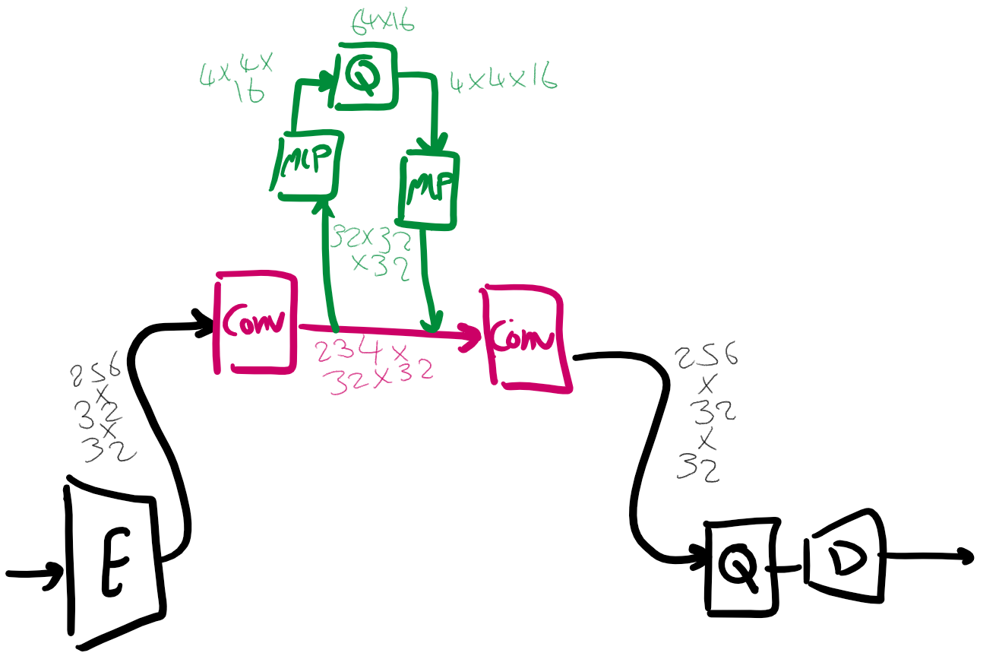

# Installation.
Please, look at the `README.md` file, especially `environment.yaml`

# How to run an experiment
I have only run this on ARC, but will probably work on `lambdapgml` too. 
If you would like to use ARC, please refer to [this link](https://docs.google.com/document/d/1_EJmQGZimb1zFLvXwR7Lcl84soiReyrBauSbtuOCLA4/edit?usp=sharing)  

Look at run `run_disentangler.sh` to see what python command needs to be run.
The parameters for the model are defined in `configs/custom_vqgan-256emb-512img-phylo-vqvae.yaml`
For an experiment, you can find the results under `logs/` folder.

# The model
`Phylo-VQVAE-model_summary.txt` shows the architecture of `Phylo-VQVAE`.

# The data
The data can be found on `lambdapgml` at `/raid/elhamod/Fish/phylo-VQVAE`.

# Meaning of different parameters for PhyloVQVEA
## The codebook definition 
 - `embed_dim`: `n_z` from the paper.
 - `n_embed`: `|Z|` from the paper.

## The phylo embedding definition
 - `n_phylolevels`: the number of phylogenetic levels. Historically, it has been 4.
 - `codebooks_per_phylolevel`: Each phylogeny level will be described by the combination of `codebooks_per_phylolevel` codebooks.
 - `n_phylo_channels`: coming from the encoder of the base model, `n_phylo_channels` will be used for phylogeny, and the rest will be passed through.

## The autoencoder definition
 - `z_channels`: `n_e` from the paper.
 - `resolution`: should match input image resolution.
 - `in_ch`: input image number of channels.
 - `ch`: number of channels in first hidden layers.
 - `ch_mult`: multiplyer for num_channels in hidden layers wrt `ch` (not cascaded) (resolution just gestsdivided by 2 each layer, except for last layer).